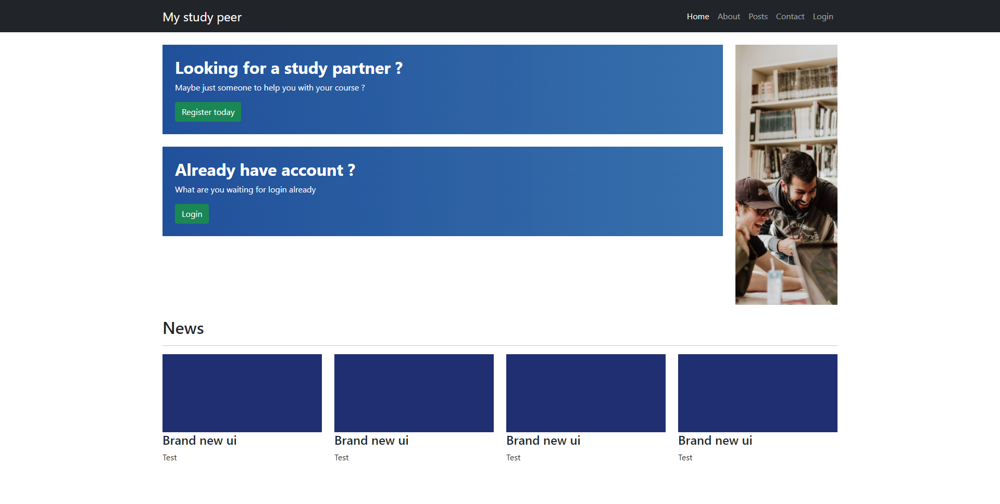
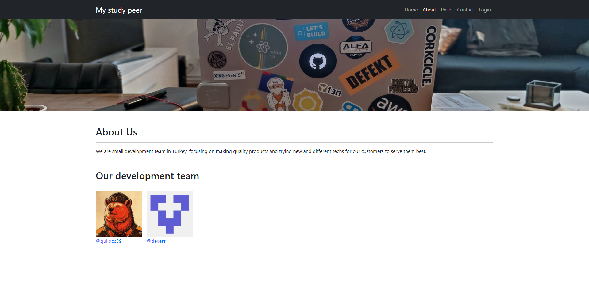
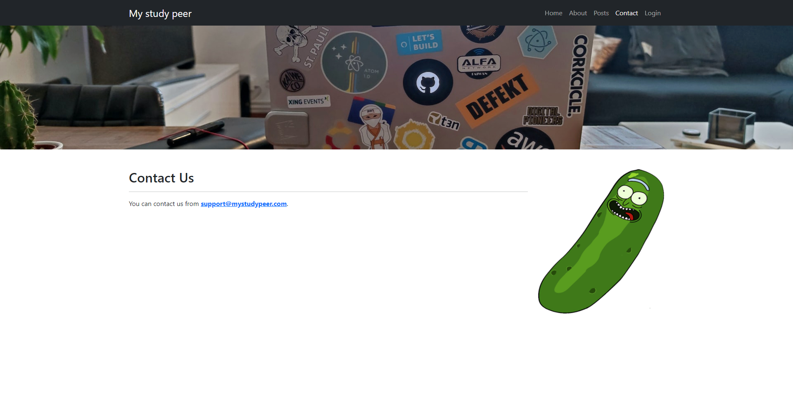
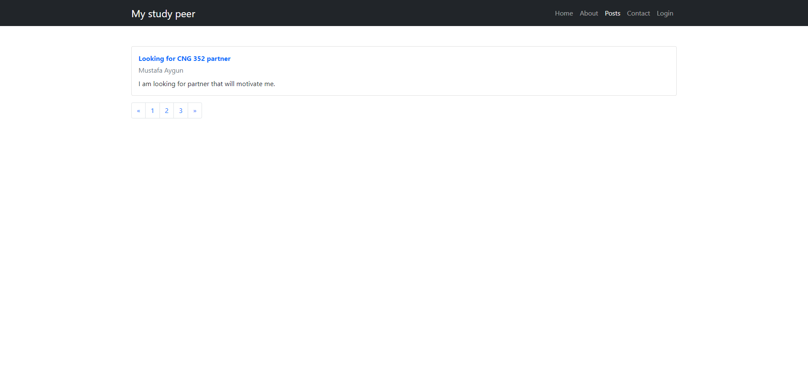
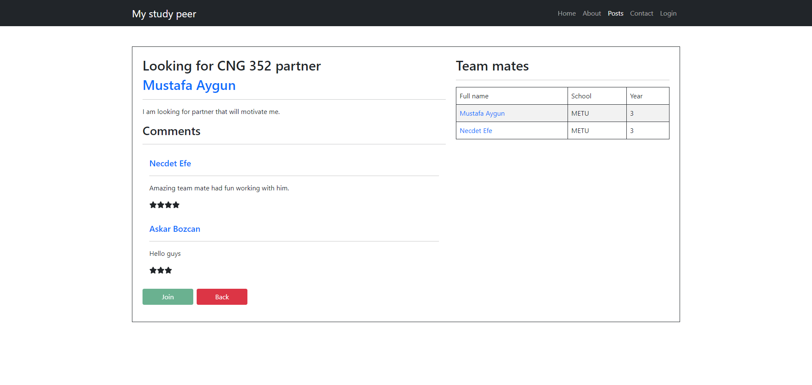
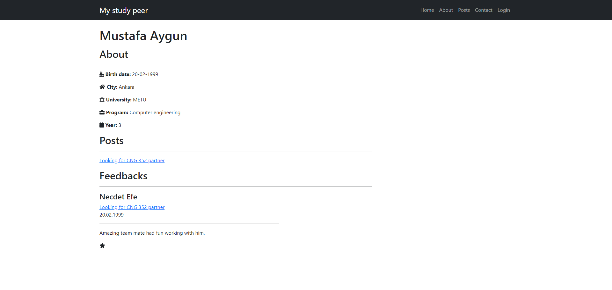
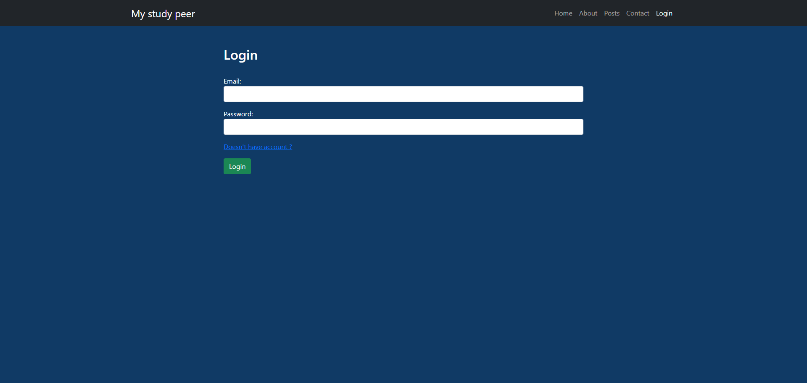
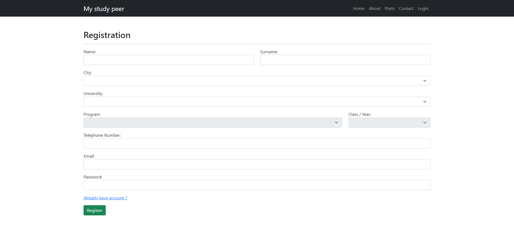

# Welcome to My Study Peer

School project that we are doing with a friend.

## Requirements

You need to have [Node.js](https://nodejs.org/en/) installed.

## How to install

`npm install`.

## How to run

`npm run develop`.

## Some images from website

### Home page

### About page

### Contact page

### Posts page

### Post page

### Profile page

### Login page

### Register page

